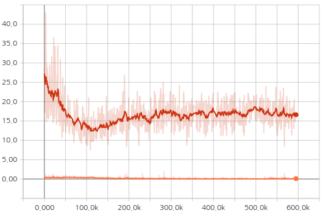
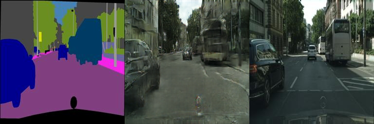
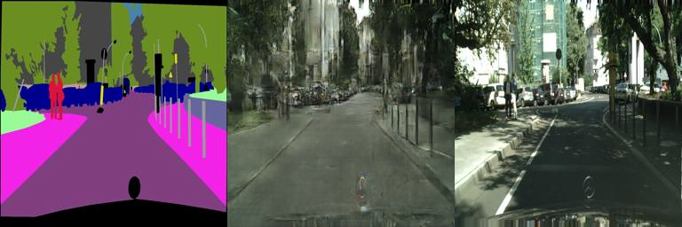
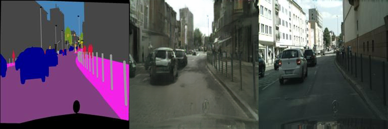
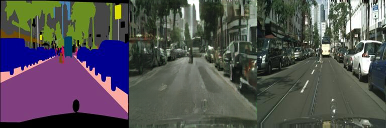
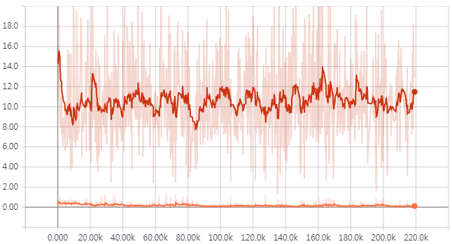
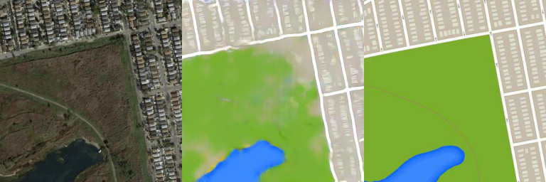
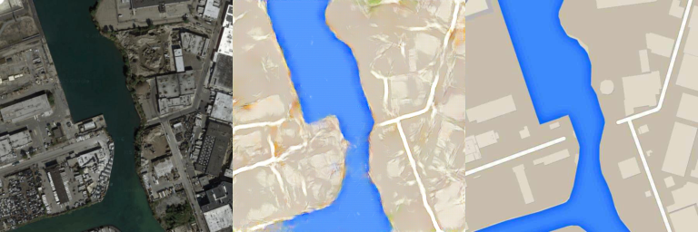
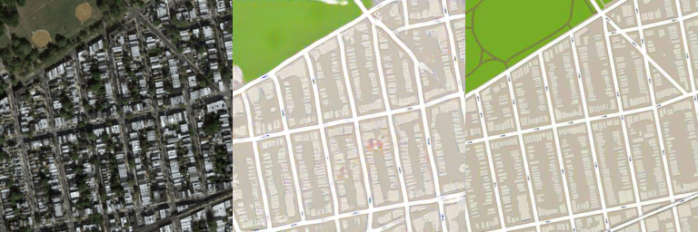
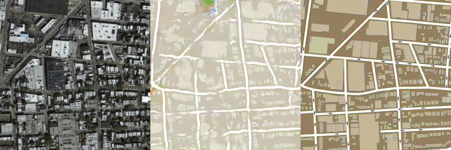

# pix2pix
PyTorch implementation of Image-to-Image Translation with Conditional Adversarial Nets (pix2pix)

## Generating Facades dataset
* Image size: 256x256
* Number of training images: 400
* Number of test images: 106

### Results
* Adam optimizer is used. Learning rate = 0.0002, batch size = 1, # of epochs = 200:

GAN losses  (Red: Generator / Orange: Discriminator) | Generated images (Input / Generated / Target)
:---:|:---:
 | 

* Generated images using test data

|1st column: Input / 2nd column: Generated / 3rd column: Target|
|:---:|
||
||
||
||
    
## Generating Cityscapes dataset
* Image size: 256x256
* Number of training images: 2,975
* Number of test images: 500

### Results
* Adam optimizer is used. Learning rate = 0.0002, batch size = 1, # of epochs = 200:

GAN losses  (red: generator / orange: discriminator) | Generated images (Input / Generated / Target)
:---:|:---:
 | 

* Generated images using test data

|1st column: Input / 2nd column: Generated / 3rd column: Target|
|:---:|
||
||
||
||

## Generating Maps dataset
* Image is resized to 256x256 image (Original size: 600x600)
* Number of training images: 1,096
* Number of test images: 1,098

### Results
* Adam optimizer is used. Learning rate = 0.0002, batch size = 1, # of epochs = 200:

GAN losses  (red: generator / orange: discriminator) | Generated images (Input / Generated / Target)
:---:|:---:
 | 

* Generated images using test data

|1st column: Input / 2nd column: Generated / 3rd column: Target|
|:---:|
||
||
||
||
    
### References
1. https://github.com/mrzhu-cool/pix2pix-pytorch
2. https://github.com/junyanz/pytorch-CycleGAN-and-pix2pix
3. https://github.com/znxlwm/pytorch-pix2pix
4. https://affinelayer.com/pix2pix/