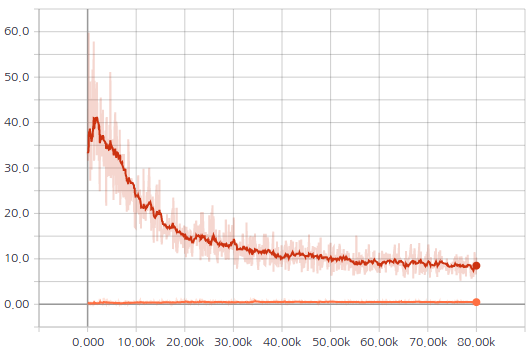
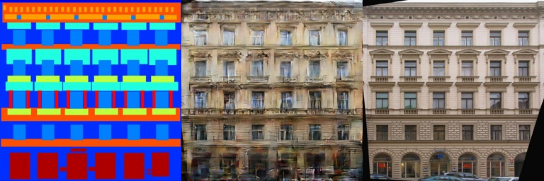
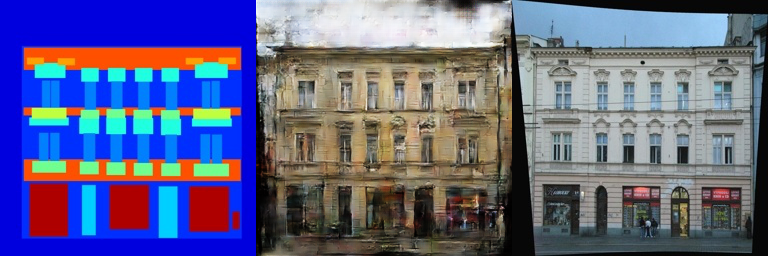
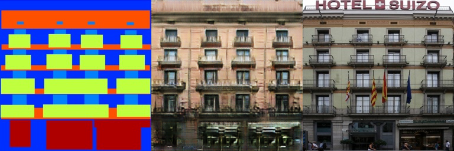
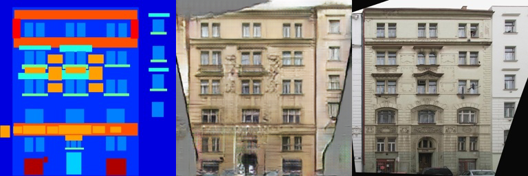

# pix2pix
PyTorch implementation of Image-to-Image Translation with Conditional Adversarial Nets (pix2pix)

## Generating Facades dataset
* Image size: 256x256
* Number of training images: 400
* Number of test images: 106

### Results
* Adam optimizer is used. Learning rate = 0.0002, batch size = 1, # of epochs = 200:
<table align='center'>
<tr align='center'>
<td> GAN losses</td>
<td> Generated images</td>
</tr>
<tr>
<td>
<td>
</tr>
</table>

* Generated images using test data
    * 1st column: Input / 2nd column: Generated / 3rd column: Target
    
    
    
    
    
### References
1. https://github.com/mrzhu-cool/pix2pix-pytorch
2. https://github.com/junyanz/pytorch-CycleGAN-and-pix2pix
3. https://github.com/znxlwm/pytorch-pix2pix
4. https://affinelayer.com/pix2pix/